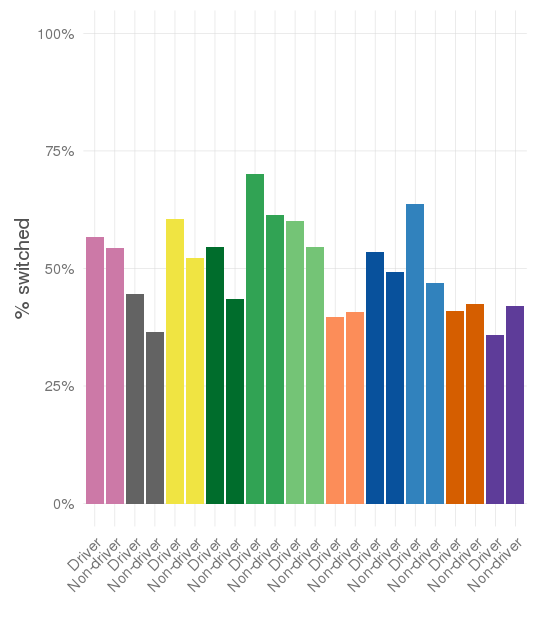
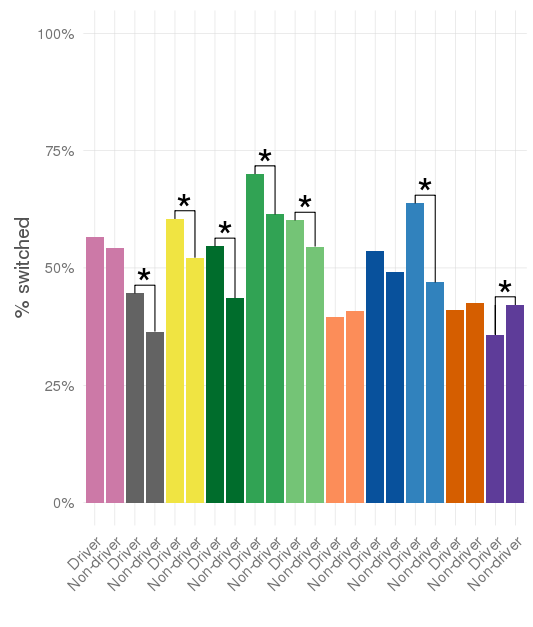
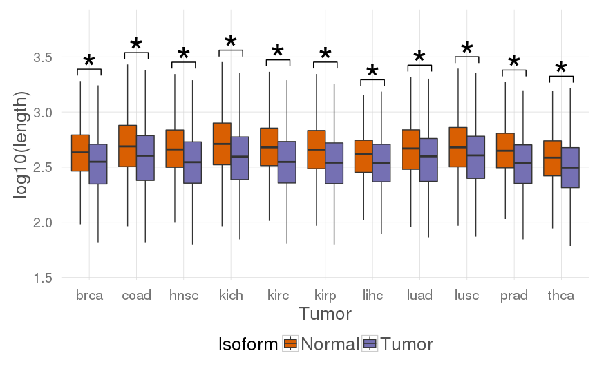

# ggstars
Easily add significance marks to your ggplots.

## Install

Install it from GitHub:

```{r}
devtools::install_github("hclimente/ggstars")
```

## Usage

### On a barplot

```{r}
library(ggstars)
data(barexample)

driver.enrichment
#    Tumor SwDr NSwDr SwNDr NSwNDr            p        OR
# 1   brca  277   212  7375   6197 3.318866e-01 1.0978611
# 2   coad  197   245  4240   7394 6.181956e-04 1.4021240
# 3   hnsc  298   195  6497   5949 3.287805e-04 1.3992656
# 4   kich  249   207  5232   6773 3.722211e-06 1.5571094
# 5   kirc  383   164  8719   5482 4.346935e-05 1.4683049
# 6   kirp  297   197  7177   5975 1.658190e-02 1.2550977
# 7   lihc  154   235  4204   6092 6.366161e-01 0.9496179
# 8   luad  250   217  6302   6505 7.329227e-02 1.1891670
# 9   lusc  336   191  6072   6872 3.397120e-14 1.9908141
# 10  prad  173   249  5150   6964 5.480876e-01 0.9394960
# 11  thca  150   269  5078   6984 1.019458e-02 0.7669373

p
```

```{r}
star_bar(p, driver.enrichment$p < 0.05)
```


### On a boxplot

```{r}
library(ggstars)
data(boxexample)

> head(isoform.lengths)
#   Tumor IsoformOrigin Length
# 1  brca        Normal    341
# 2  brca        Normal    266
# 3  brca        Normal    340
# 4  brca        Normal    773
# 5  brca        Normal    272
# 6  brca        Normal    925

p
```

```{r}
star_box(p, p.vals$p < 0.05)
```

